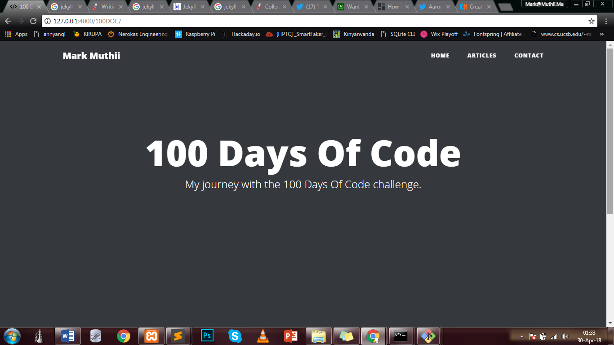
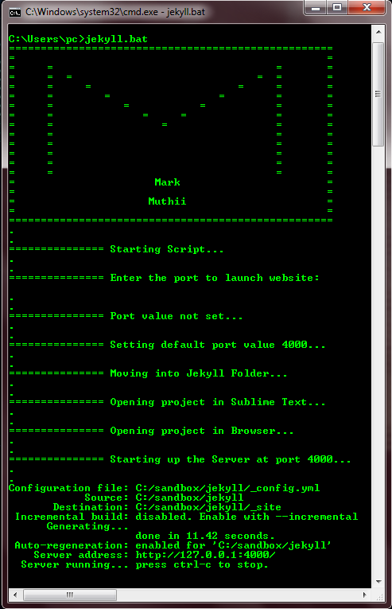

# 100 Days Of Code - Log

## Day 0: Sunday, 29th April 2018

**Today's Progress:** Re-engaged with my Jekyll blog after some weeks of neglect (Sorry bloggy!). Learnt about collections which in Jekyll are like pages and posts, but are not quite pages or posts.

 

**Thoughts:** I have been learning to code for some time, but haven't been as consistent as I would have wanted. I think this challenge, what with it's online community, will be a great way for me to get back to what I have come to love a lot, and to stay consistent.

**Note:** As soon as I finish up with setting up the log section on my site, future logs will feature there. But until then, this will do :).

**Links:**
1. [Twitter Status](https://twitter.com/muthiimm/status/990718211644641280)

## Day 1: Monday, 30th April 2018

**Today's Progress:** Continued working on my Jekyll site. Also, I batched the process of opening the local version on my browser and in sublime text, plus firing up the jekyll server. So now all that is handled by one script file. Say it with me: Hip Hip...!

 

**Thoughts:** Too tired for extra thoughts today (yawns).

**Links:**
1. [Twitter Status](https://twitter.com/muthiimm/status/991168351035625472)
